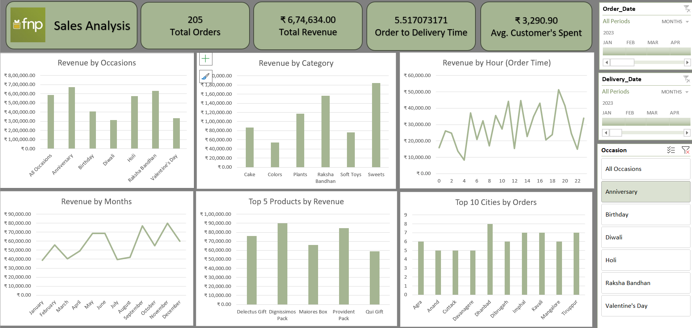

# Sales Analysis Dashboard (Microsoft Excel)

## Overview

The Sales Analysis Dashboard is an interactive Excel-based business intelligence project designed to analyze sales performance and generate actionable business insights. It transforms raw sales data into an easy-to-understand dashboard that helps stakeholders monitor KPIs, identify sales trends, and support data-driven decision-making.

---

## Objectives

- Analyze overall sales performance
- Monitor key business KPIs
- Identify top-performing products and categories
- Track monthly and occasion-wise sales trends
- Analyze customer purchasing behavior
- Support business decisions through interactive visualizations

---

## Dashboard Preview


---

## Key Performance Indicators (KPIs)

- **Total Orders:** 205
- **Total Revenue:** ₹6,74,634
- **Average Order-to-Delivery Time:** 5.52 Days
- **Average Customer Spend:** ₹3,290.90

---

## Dashboard Features

- Revenue by Occasion
- Revenue by Product Category
- Revenue by Month
- Revenue by Order Time
- Top 5 Products by Revenue
- Top 10 Cities by Orders
- Interactive Slicers
  - Order Date
  - Delivery Date
  - Occasion

---

## Key Insights

- Anniversary generated the highest revenue.
- Sweets were the best-performing product category.
- Sales peaked during September and November.
- Afternoon and evening were the highest revenue-generating hours.
- Dignissimos Pack was the top-selling product.
- Dhanbad recorded the highest number of customer orders.

---

## Tools & Technologies

- Microsoft Excel
- Pivot Tables
- Pivot Charts
- Slicers
- Data Cleaning
- KPI Cards
- Dashboard Design

---

## Skills Demonstrated

- Data Cleaning
- Data Analysis
- Dashboard Development
- KPI Reporting
- Business Intelligence
- Data Visualization
- Excel Automation
- Business Insights

---

## Business Value

This dashboard helps businesses:

- Monitor sales performance in real time
- Identify revenue trends
- Improve inventory planning
- Understand customer purchasing behavior
- Support strategic decision-making
- Optimize marketing campaigns

---

## Repository Structure

```
Sales-Analysis-Dashboard/
│
├── Dashboard.xlsx
├── Dashboard.png
├── Project Report.pdf
├── Dataset.xlsx
└── README.md
```

---

## Future Improvements

- Power BI version of the dashboard
- SQL integration for automated data updates
- Power Query for data transformation
- Sales forecasting using Excel Forecast Sheet
- Customer segmentation analysis

---

## Author

**Aarya Chaudhari**

Aspiring Data Analyst | Business Analyst | MIS Analyst
**Skills:** Excel • Data Visualization • Dashboard Development
---

If you found this project useful, consider giving it a ⭐.
